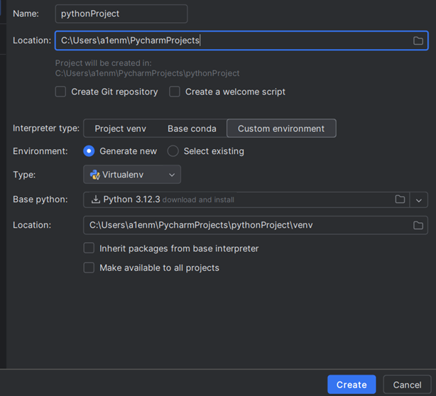
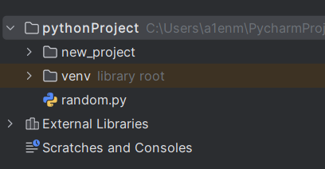
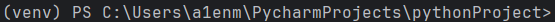
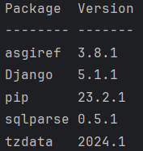
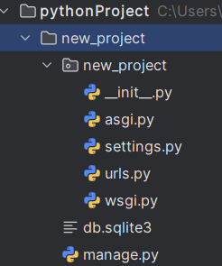
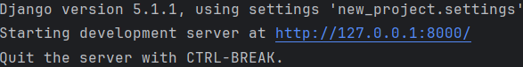

# Инструкция по установке веб-фреймворка Django
_________________________________________________________________

Django — это один из самых популярных серверных веб-фреймворков, который написан на языке Python. 

## Установка

Перед тем как начать работать с фреймворком, нам нужно создать проект и виртуальное окружение в Pycharm. 

Повторяем действия, показанные на скриншоте.





После установки в левой части экрана появится проект и активированное виртуальное окружение 



Для проверки активации виртуального окружения нужно ввести следующую команду:


```
venv\Scripts\activate

```


Виртуальное окружение активировано



После того как активировано виртуальное окружение, вводим в консоли команду

```
python -m pip install Django

```

Проверяем установленные библиотеки с помощью команды
```
pip list

```
__Django успешно установлен__




>
>

Создаем проект помощью команды

```
django-admin startproject new_project

```
___new_project___ — это название нашего проекта, вы можете выбрать любое другое название


Создан каталог с файлами конфигурации 


Переходим в папку проекта

```
cd new_project
```

И запускаем команду 
```
python manage.py runserver

```




***Успешно!***

После запуска проекта мы видим адрес, по которому запущен проект, http://127.0.0.1:8000/. 

